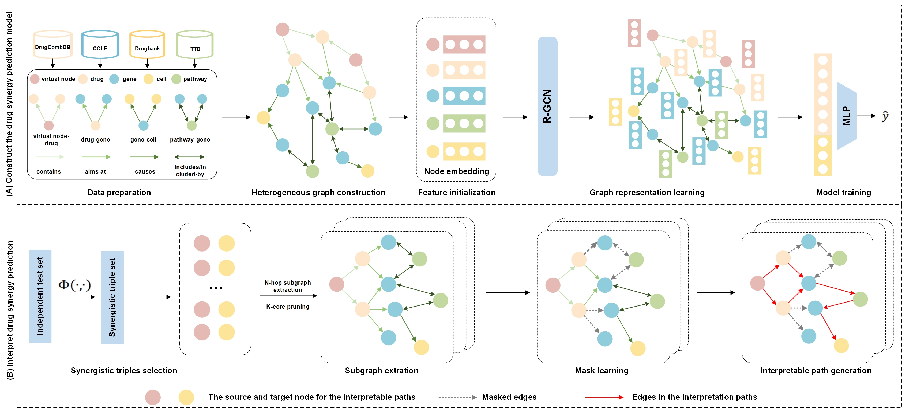

# SDCInterpreter

#### This repository contains the code and data for "Path-based graph neural network for drug synergy prediction and interpretation".

## Overview  



## Requirements
- Please follow the links below to install PyTorch and DGL with proper CUDA versions
    - PyTorch https://download.pytorch.org/whl/torch_stable.html
    - DGL https://data.dgl.ai/wheels/cu116/repo.html
- Our code has been tested with
    - python == 3.7.16
    - numpy == 1.21.6
    - pandas ==1.3.5
    - pytorch == 1.13.1+cu116
    - dgl == 1.1.2+cu116
    - packaging == 23.1
    - pyYAML == 6.0.1
    - matplotlib == 3.5.3
    - scikit-learn ==1.0.2


### The repository is organized as follows

- `Data/` contains the datasets used in the SDCInterpreter model;
- `Model/` contains the implementation of the SDCInterpreter model;
- `Utils/` contains the universal tool functions for prediction and interpretation;
---

# Usage
```
# predict drug synergy
python train.py
# interpret synergy
python interpret.py
```

## Results

### Quantitative
- Evaluate saved explanations
```
python valid_path.py
python eval_explanations.py --emb_dim=64 --hidden_dim=64 --out_dim=64 
```


### Concat
Author: Shuo Wang Mail: 2023120666@mail.scuec.edu.cn

Corresponding author: Xian-gan Chen Mail: chenxg@mail.scuec.edu.cn

Date: 2025-12-5

School of Biomedical Engineering, South-Central Minzu University, China